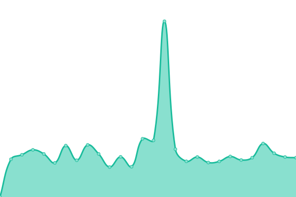

# [📈 Live Status](https://upptime.brianmartinez.dev): <!--live status--> **🟧 Partial outage**

This repository contains the open-source uptime monitor and status page for [Brian Martínez Rodríguez](https://brianmartinez.dev), powered by [Upptime](https://github.com/upptime/upptime).

With [Upptime](https://upptime.js.org), you can get your own unlimited and free uptime monitor and status page, powered entirely by a GitHub repository. We use [Issues](https://github.com/brianmrdev/upptime/issues) as incident reports, [Actions](https://github.com/brianmrdev/upptime/actions) as uptime monitors, and [Pages](https://upptime.brianmartinez.dev) for the status page.

<!--start: status pages-->
<!-- This summary is generated by Upptime (https://github.com/upptime/upptime) -->
<!-- Do not edit this manually, your changes will be overwritten -->
<!-- prettier-ignore -->
| URL | Status | History | Response Time | Uptime |
| --- | ------ | ------- | ------------- | ------ |
|  [Personal Web](https://brianmartinez.dev) | 🟥 Down | [personal-web.yml](https://github.com/brianmrdev/upptime/commits/HEAD/history/personal-web.yml) | 

 157ms
     
 | 

<a href="https://upptime.brianmartinez.dev/history/personal-web">0.00%</a>
    

|  [Trading Platform](https://trading.brianmartinez.dev) | 🟥 Down | [trading-platform.yml](https://github.com/brianmrdev/upptime/commits/HEAD/history/trading-platform.yml) | 

 83ms
     
 | 

<a href="https://upptime.brianmartinez.dev/history/trading-platform">0.00%</a>
    

|  [ACEM Web](https://www.acem.life) | 🟩 Up | [acem-web.yml](https://github.com/brianmrdev/upptime/commits/HEAD/history/acem-web.yml) | 

 847ms
     
 | 

<a href="https://upptime.brianmartinez.dev/history/acem-web">100.00%</a>
    

<!--end: status pages-->

[**Visit our status website →**](https://upptime.brianmartinez.dev)

## 📄 License

- Powered by: [Upptime](https://github.com/upptime/upptime)
- Code: [MIT](./LICENSE) © [Anand Chowdhary](https://anandchowdhary.com), supported by [Pabio](https://pabio.com)
- Data in the `./history` directory: [Open Database License](https://opendatacommons.org/licenses/odbl/1-0/)
